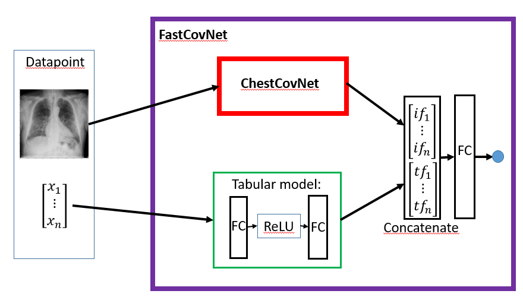

### FastCovNet

In this section, we present the FastCovNet architecture, the experiments and their results. FastCovNet should be an architecture capable of intaking chest X-ray images and tabular, structured data from a patiend (i.e., multimodal data) and predict the target variable, COVID19 positive or negative. The tabular data are several variables from the patient, ranging from sex and age to to blood levels of potasium or eosinophils. 

The motivation for trying to develop this architecture is two-fold: on one hand, we think that it would be cool to do Deep Learning with a mixture of image data and tabular data, and on the other hand, we expect this architecture to improve the classification metrics. This approach is not unique, as we can see in [this](https://github.com/naity/image_tabular) and [this](https://www.ncbi.nlm.nih.gov/pmc/articles/PMC7150512/pdf/main.pdf) examples, but it is not too common either. We believe one of the main reasons for not being more widespread is the data scarcity, especially in healthcare settings.

-------------------------------------

## The architecture

Below we present a scheme of FastCovNet's architecture:

As it can be seen, it consists of two parts, an image processing part and a tabular data processing part. The image processing part is the result of the previous step of the project, the ChestCovNet architecture, while the tabular data processing part consists of two fully connected layers with a ReLU activation between them. These two independent modules output the image features vector and the tabular features vector. These two vectors are then concatenated (an operation that is *backprop-able*) and passed through a linear layer with one single output neuron (followed by a sigmoid operation) acting as the classifier. The reason for putting a hidden layer in the tabular module is to give that module the oportunity to learn nonlinearities in the tabular data. The architecture within the image module (ChestCovNet) is GoogLeNet, for reasons previously explained in the corresponding [section](https://github.com/FastCovNetProject/FastCovNetProject/tree/main/COVID%20Classification/ChestCovNet). 

As mentioned, one of the first hypothesis regarding the experiments with FastCovNet is that it will be able to outperform ChestCovNet. Prior evidence supporting this idea is the fact that an XGBoost classifier trained over the tabular data alone is able to predict the target variable with high accuracy (above 80%). Unfortunately, we have not been able to see this results in our experiments, as it is shown in the following section. In addition, basic hyperparameter search and fine-tuning has been carried on, due to limited remaining time of the project.

-------------------------------------

## Experiments and results

-------------------------------------

## Conclusions
