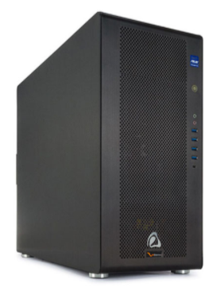
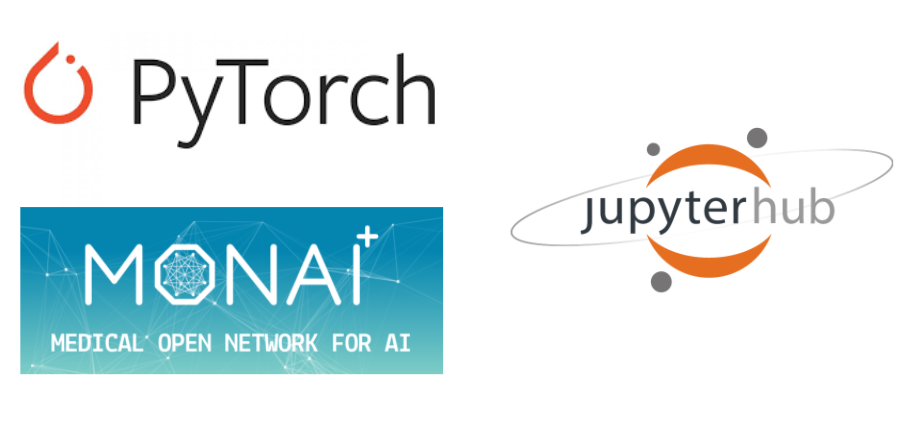
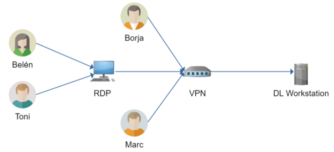

## Hardware we're using
We're using a new DL workstation with the following specs:
* Intel Xeon 18 Cores
* 128 GB RAM
* NVIDIA Titan RTX 24GB
* 1TB NVMe + 16TB HDD
* Ubuntu 20.04 LTS

## Frameworks & Platform
Our workstation has Ubuntu 20.04 LTS installed. In it, we installed JupyterHub, in order to work multiuser, and on top of it, we used two Frameworks: Pytorch and MONAI (which is also based on Pytorch). MONAI offers us some extra transformations that are very useful in the medical field, as well as some extra predefined networks.

## Networking & Security
For the legal concerns, datasets are kept in the workstation as anonymous as possible, so they can be used for research. 
We've blocked our workstation for data extraction. In order to do so, we’ve set up a VM that is securely connected to the workstation and that has IP filtering and some policies that block data extraction. This is the VM that the members that don't work at AQuAS are using.

