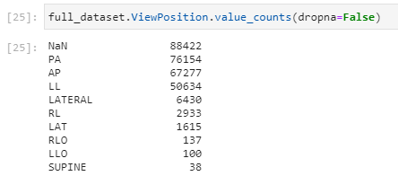
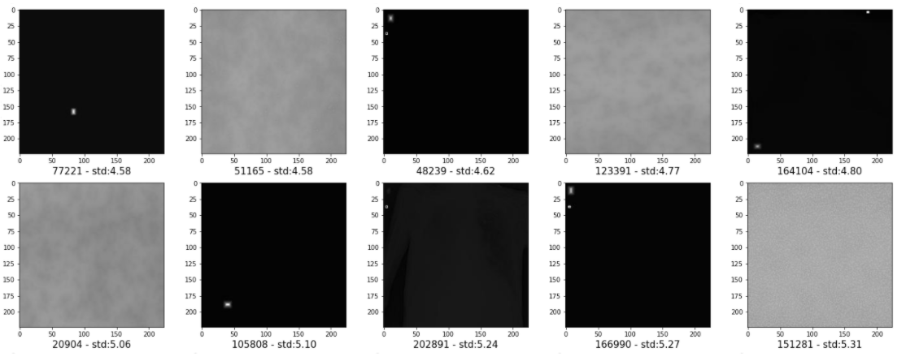
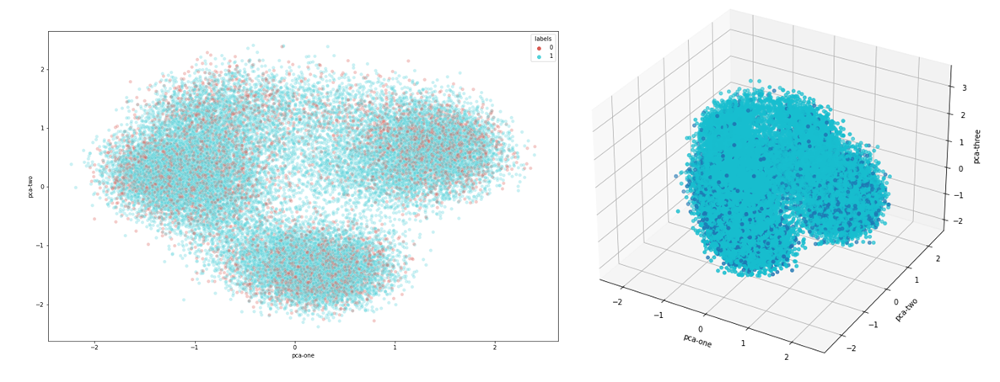
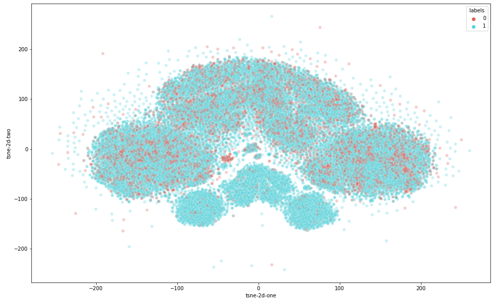
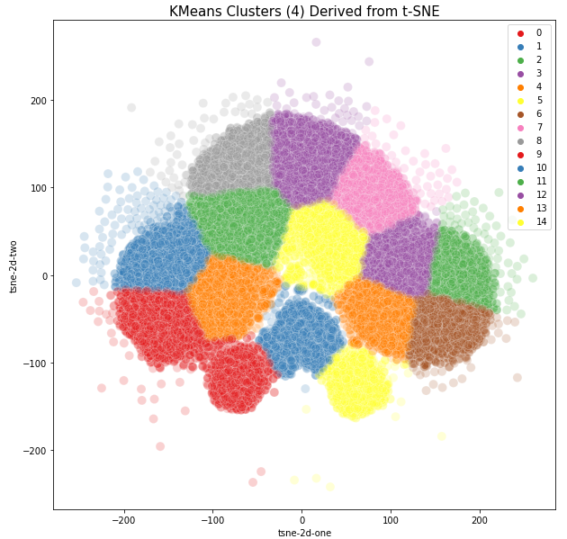
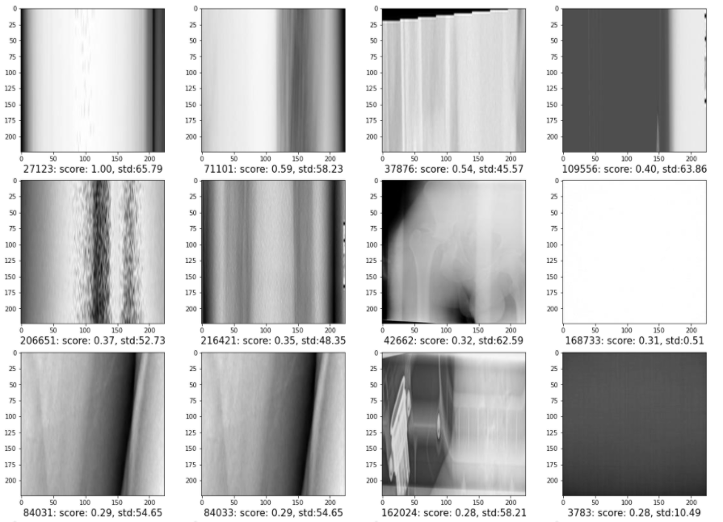

# Data Preprocessing
## Data sources
All the data used in this project comes from the PADRIS program and has been previously anonymized. It has been gathered from the following sources:
* SIMDCAT (Sistema d'Imatge Mèdica Digital de Catalunya): Medical images we're using to classify whether our patient is COVID positive or not come from this repository. These images are stored in the DICOM standard.
* Catalan COVID19 Registry: In this registry we have the patients that have been tested positive using the PCR technique, as well as the date they had this test done.
* Central Insured Registry: This is where our patients age and sex comes from.

## Data manipulation
### Image data
In order to feed our algorithms, we first had to manipulate our DICOM images. DICOM files tend to have hundreds of text variables (like Manufacturer, S/N, many Ids, view position, radiation...), as well as the image itself. This image can use many formats, but one of the most common formats would be a special type of JPEG Lossless, encoded in 16 bits of precision. The steps we did are the following:
1. Extract relevant DICOM metadata
1. Extract the image from DICOM file
1. Remove the black border surrounding the image
1. Resize image to 224x224 and convert it to regular "lossy" JPG.

### Tabular data
The data for the Gold Dataset was not stored in a estructured database therefore we had to take non-conventional steps for data retrieval:
1. Using AutoHotKey an automat was created that interated through a list of patients IDs. This automat interacted with the Clinical Management Application (Argos) in the computer replicating the steps that a human would perform to interact with it. For performing this step a great knowledge of Argos' functioning was needed, examples are not included for security reasons. 
2. Argos shows the information in .pdf format, the information was copied to .txt.  
3. A custom Python loop was created for each clinical data modality (example for blod tests included in folder). It iterated through patients and extracted the relevant data to .csv format.
4. Data in .csv format was handed over to Padris for annonymization, codification and association with images. 

## Cohort creation
### Case and Control definition
In order to create our cohort, we asked PADRIS chest images and some metadata from patients that had been PCR positive for COVID, as well as extra data from patients that don't have COVID.
Even though the date that our patients were tested COVID positive, most of our RX images weren't done the same day of the PCR test. Based in Belén Del Río's team experience, as well what could find in previous papers, we decided to consider COVID positive to the RX images that met the following two criterias:
* RX image done at least 2 days before the positive PCR
* RX image done at most 14 days after the positive PCR

Moreover, our Control cases would have to meet at least one of the following criterias:
* RX image done at most 60 days before a positive PCR
* RX image done before year 2020

### Experiment Replication
One of the main components of the scientific method is the ability to replicate the experiments. Even though the dataset we're using is not public, we wanted to make sure we could reproduce our experiments. To do so, we randomized and splitted our train, validation and test datasets, so that in future experiments we don't use trained images in validation/test steps. Moreover, we've set a fixed seed number, so all randomized functions can be reproducible.

### Balancing dataset distribution
We looked at the distribution of the COVID results across "sex" and "age" variables, in order to make sure the network wasn't inferring when taking its decision. The "sex" variable was very balanced, while "age" was a bit higher for COVID positive, but not enough to affect our result.

### Dataset bias avoiding
Even though we had a balanced dataset across "sex" and "age" variables, we've put special effort in making sure that the network is learning what we want, and that it's not using "tricks" that help it to get better results. We detected several cases where the network could have an undesired advantage:
1. **Different RX images from the same patient mixed between datasets:** Patients with COVID tend to have more than one RX done during the period of their desease. The network will probably guess correctly if the network is trained with one of those images and then tested with another one, done with a few days of difference.
   * **What we did:** We made sure that each patient could be only in one dataset.
1. **Different RX machines:** Our RX images are done in very different RX machines (different brands and models), with different distributions of COVID positives. The network could guess which RX machine did the image and then infer the result according to its COVID probability distribution. The most obvious case are portable RX machines: They are lower quality, they tend to have the text "Portàtil" anotated somewhere in the image and have way more COVID positive rates than regular ones.
   * **What we did:** We analysed the frequency distribution of all Manufacturers / Model names and decided to keep only the RX images from the most common RX machine (which was not portable), the "Philips DigitalDiagnost". This way, all images will also have similar image quality.
1. **Different RX view positions:** The 3 most common view positions are: PA (posteroanterior), AP (anteroposterior) and LL (lateral). These 3 viewpositions have different COVID positive rates, so the network could infer that.
   * **What we did:** Since PA is the most common position, and the one that they should use to diagnose COVID (unless, due to the patient condition, it's not feasible), we decided to train the network with only PA positions. We could have balanced all positions, but we had enough images and it was not necessary for the goal of this project.
1. **Duplicate images:** Even though we ended up making sure each patient is only in one dataset, we wanted to make sure that we didn't have any duplicate images across datasets that could affect our results.
   * **What we did:** We calculated the MD5 hash of all images, and looked for duplicates. Surprisingly, we found a few number of duplicates but, as expected, they were tagged to the same patient, so they wouldn't have been leaked between dataests. We removed these files.

### Null ViewPosition classification
As explained in previous sections, we did the COVID classification using only RX images that were done in PA position. We found that a big part of our dataset didn't have the ViewPosition field informed, so we were not including these cases in our study.

Our Silver Dataset was not affected by these null images, since the only RX machine model we're including in this dataset had all ViewPosition fields informed. Unfortunately, this was not the case for the Gold Dataset, where Bellvitge also uses different RX brands that don't inform its ViewPosition. Since we could't afford to lose RX images from our Gold Dataset, we decided to use a NN to assign the ViewPosition.

With more than 150k images to train, validate and test the network, we got >96% accuracy in only 15 epochs on not pretrained Densenet121. We inferred the ViewPosition to all images that didn't have this field informed and, thanks to that, we could increase our Gold Dataset from XXX to YYY images.

### Removal of blank/empty RX images
During our dataset exploration, we found that some RX images were not done correctly and were "grey", with no patient in it. Since these images could reduce the performance of our networks, we decided to try remove them.

We imagined that these grey images would have a small pixel array standard deviation. As expected, the images with the smallest values were the "grey" ones, and the ones that we finally removed from our datasets:

### Removal of images wrongly labeled as "Chest" body position
Another thing we noticed while exploring our dataset was that there were some images that represented parts of the body different than "Chest" (hands, feet...). In order to remove them, we explored two ideas:
1. Finding clusters with PCA/t-SNE + k-means
1. Use of image retrieval techniques to find similar wrongly labeled images.

For both ideas, we first had to do the following steps:
1. Load a pretrained Resnet and create a dataloader with all images and the same transformations we were using in Validation.
1. Remove the classification layer of the network and extract the features of our images
1. L2 normalize them

#### 1) Finding clusters with PCA/t-SNE + k-means
k-means algorithm works best with low dimensionality features. We tried PCA and t-SNE to do so:

##### *PCA way*
We applied PCA and reduced our features to 3 dimensions. Even though in the plots it looked like we could find something, our features explained only the 23% of our variance.

Because of that, we directly went to the t-SNE way

##### *t-SNE way*
Before applying t-SNE on high dimensional data, it's often recommended to reduce its dimensionality using tools like PCA. We followed the following steps:
1. Apply PCA and reduce from 2048 dimensions to 400 (99% of variance), although we also tried with 50, 100 and 200
1. L2 normalize them
1. Apply t-SNE with 2 components, a high number of iterations (10k) and different perplexities.

We found that we could see better clusters with Perplexity = 25:

##### The clustering
We decided to start with 4 clusters, since the "Elbow method" suggested it would be the best number.

However, we could not find any cluster of different body positions. We retried clustering with a bigger number, 15, but we got the same results. In fact, as we can see in the plot, clusters are still pretty big, and images that are far from the accumulation points (which are probably the ones we're interested to remove) are included in big clusters as well.

#### 2) Use of image retrieval techniques to find similar wrongly labeled images
To find similar images, we applied a PCA(512) to the normalized data at the start of this section, and we L2 normalized again. Then, we picked the features of the image on which we wanted to find similar ones and applied the dot product to the whole features. The images with bigger score are the most similar (including the image itself, whichobviously scores 1), while the ones with less score are the least similar.

Thanks to this technique, we could also find and remove "grey" and blurry images that we could not find with the "Standard Deviation" techique from before:

## Conclusions
In order to have a good image classification model, it's very important to have a lot of good quality data. Unfortunately, both things, quantity and quality of data, are very hard to achieve in the medical field.
It took aprox. 4 months to complete the circuit of image retrieval, even though we already knew the theorical steps to follow. Meanwhile, could build the infrastructure, security measures and practice with different datasets.
On the other hand, we had to spend lots of hours in preprocessing this data, as we've described in this section. There was a lot of data visualization and filtering involved, as well as analysis on how to join data from different sources.
Moreover, we also found that we had some low quality images and labels. We used several techniques to improve our dataset:
* Missing labels imputation:
   * **Worked**: Classification of missing ViewPosition data with Densenet121
* Image removal:
   * **Worked**:
      * Image pixel standard deviation filtering
      * Similar image scoring
   * **Didn't work very well**:
      * Image pixel average value filtering 
      * PCA/t-SNE + k-means clustering
