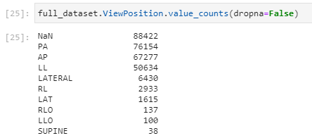

# Preprocessing
## Data sources
All the data used in this project comes from the PADRIS program and has been previously anonymized. It has been gathered from the following sources:
* SIMDCAT (Sistema d'Imatge Mèdica Digital de Catalunya): Medical images we're using to classify whether our patient is COVID positive or not come from this repository. These images are stored in the DICOM standard.
* Catalan COVID19 Registry: In this registry we have the patients that have been tested positive using the PCR technique, as well as the date they had this test done.
* Central Insured Registry: This is where our patients age and sex comes from.

## Data manipulation
### Image data
In order to feed our algorithms, we first had to manipulate our DICOM images. DICOM files tend to have hundreds of text variables (like Manufacturer, S/N, many Ids, view position, radiation...), as well as the image itself. This image can use many formats, but one of the most common formats would be a special type of JPEG Lossless, encoded in 16 bits of precision. The steps we did are the following:
1. Extract relevant DICOM metadata
1. Extract the image from DICOM file
1. Remove the black border surrounding the image
1. Resize image to 224x224 and convert it to regular "lossy" JPG.

### Tabular data
(...)

## Cohort creation
### Case and Control definition
In order to create our cohort, we asked PADRIS chest images and some metadata from patients that had been PCR positive for COVID, as well as extra data from patients that don't have COVID.
Even though the date that our patients were tested COVID positive, most of our RX images weren't done the same day of the PCR test. Based in Belén Del Río's team experience, as well what could find in previous papers, we decided to consider COVID positive to the RX images that met the following two criterias:
* RX image done at least 2 days before the positive PCR
* RX image done at most 14 days after the positive PCR

Moreover, our Control cases would have to meet at least one of the following criterias:
* RX image done at most 60 days before a positive PCR
* RX image done before year 2020

### Experiment Replication
One of the main components of the scientific method is the ability to replicate the experiments. Even though the dataset we're using is not public, we wanted to make sure we could reproduce our experiments. To do so, we randomized and splitted our train, validation and test datasets, so that in future experiments we don't use trained images in validation/test steps. Moreover, we've set a fixed seed number, so all randomized functions can be reproducible.

### Balancing dataset distribution
We looked at the distribution of the COVID results across "sex" and "age" variables, in order to make sure the network wasn't inferring when taking its decision. The "sex" variable was very balanced, while "age" was a bit higher for COVID positive, but not enough to affect our result.

### Dataset bias avoiding
Even though we had a balanced dataset across "sex" and "age" variables, we've put special effort in making sure that the network is learning what we want, and that it's not using "tricks" that help it to get better results. We detected several cases where the network could have an undesired advantage:
1. **Different RX images from the same patient mixed between datasets:** Patients with COVID tend to have more than one RX done during the period of their desease. The network will probably guess correctly if the network is trained with one of those images and then tested with another one, done with a few days of difference.
   * **What we did:** We made sure that each patient could be only in one dataset.
1. **Different RX machines:** Our RX images are done in very different RX machines (different brands and models), with different distributions of COVID positives. The network could guess which RX machine did the image and then infer the result according to its COVID probability distribution. The most obvious case are portable RX machines: They are lower quality, they tend to have the text "Portàtil" anotated somewhere in the image and have way more COVID positive rates than regular ones.
   * **What we did:** We analysed the frequency distribution of all Manufacturers / Model names and decided to keep only the RX images from the most common RX machine (which was not portable), the "Philips DigitalDiagnost". This way, all images will also have similar image quality.
1. **Different RX view positions:** The 3 most common view positions are: PA (posteroanterior), AP (anteroposterior) and LL (lateral). These 3 viewpositions have different COVID positive rates, so the network could infer that.
   * **What we did:** Since PA is the most common position, and the one that they should use to diagnose COVID (unless, due to the patient condition, it's not feasible), we decided to train the network with only PA positions. We could have balanced all positions, but we had enough images and it was not necessary for the goal of this project.
1. **Duplicate images:** Even though we ended up making sure each patient is only in one dataset, we wanted to make sure that we didn't have any duplicate images across datasets that could affect our results.
   * **What we did:** We calculated the MD5 hash of all images, and looked for duplicates. Surprisingly, we found a few number of duplicates but, as expected, they were tagged to the same patient, so they wouldn't have been leaked between dataests. We removed these files.

### Null ViewPosition classification
As explained in previous sections, we did the COVID classification using only RX images that were done in PA position. We found that a big part of our dataset didn't have the ViewPosition field informed, so we were not including these cases in our study.

We thought that we could increase our dataset count size by creating a NN Classifier to classify them. Even though we got >95% accuracy, we finally didn't use these images because none of them were done using a "Philips DigitalDiagnost" RX machine. It's very likely that this machine forces the technician to inform this variable.

### Removal of blank/empty RX images
During our dataset exploration, we found that some RX images had no patient in it, or were directly blank. Since these images could reduce the performance of our networks, we decided to try to find and remove them.
